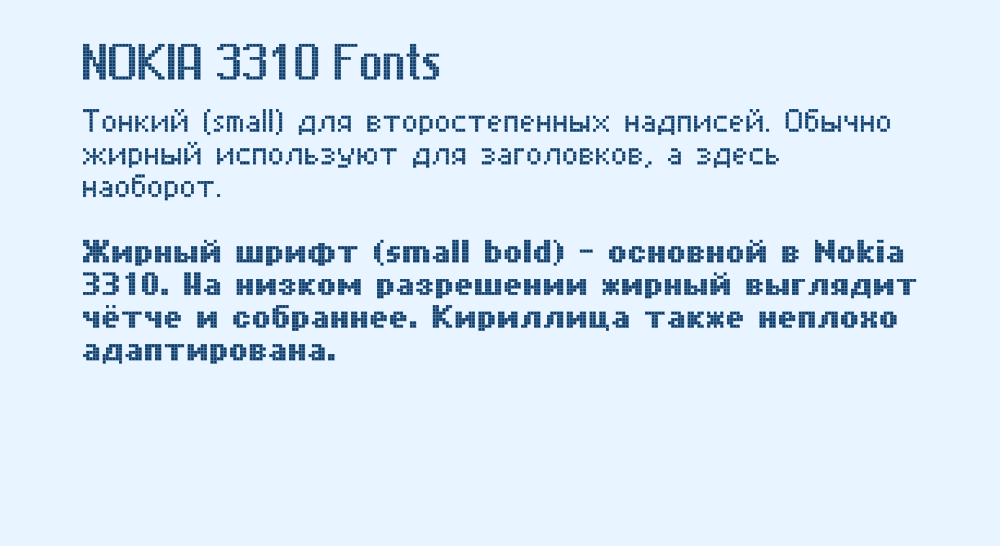

# nokia-3310-fonts-u8g2
Inspired by Nokia 3310: regular, bold, large bitmap fonts. Full UTF-8 support, English alphabet, Russian Cyrillic, special symbols. For U8g2 &amp; Arduino.



Поддерживаемые символы:
ABCDEFGHIJKLMNOPQRSTUVWXYZ
abcdefghijklmnopqrstuvwxyz
АБВГДЕЁЖЗИЙКЛМНHОOПРСТУФХЦЧШЩЪЫЬЭЮЯ
абвгдеёжзийклмнопрстуфхцчшщъыьэюя
0123456789
!#$ % &'()*+,-./:;<=>?@[\]^_{|}~`" во всех
°(00B0) знак градусов, в small версиях

```cpp
#include <Arduino.h>
#include <U8g2lib.h>

// Подключаем шрифт (файл n3310_big.c должен быть в проекте)
// Добавляем через меню: Скетч → Добавить файл… и выберите нужный файл (например, n3310_big.c).
// Файл появится отдельной вкладкой в IDE.
extern const uint8_t u8g2_font_n3310_big[] U8G2_FONT_SECTION("u8g2_font_n3310_big");

// Замените конструктор на соответствующий вашему дисплею
U8G2_ST75256_JLX256160_F_4W_HW_SPI u8g2(U8G2_R0, /* CS */ 10, /* DC */ 11, /* RST */ 12);

void setup() {
  u8g2.begin();
  u8g2.enableUTF8Print();          // обязательно для кириллицы
  u8g2.setContrast(150);           // яркость/контраст (0-255) настраивается под дисплей
}

void loop() {
  u8g2.firstPage();
  do {
    u8g2.setFont(u8g2_font_n3310_big); // название шрифта из файла
    u8g2.setCursor(0, 20);
    u8g2.print("Привет, мир!");
  } while (u8g2.nextPage());
}
```
